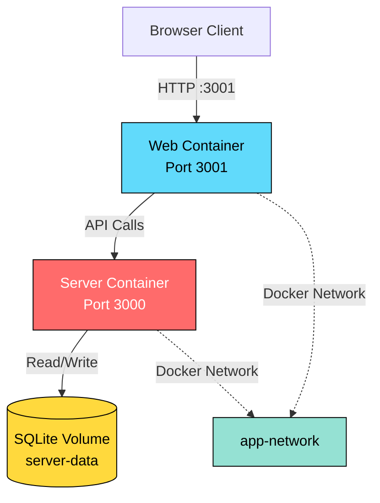

# RMS Modern - Docker Deployment Guide

Complete guide for containerizing and deploying the RMS Modern Turborepo monorepo with Docker, Bun, and Docker Compose.

## 📋 Table of Contents

- [Prerequisites](#prerequisites)
- [Project Structure](#project-structure)
- [Understanding the Architecture](#understanding-the-architecture)
- [Quick Start](#quick-start)
- [Development Workflow](#development-workflow)
- [Production Deployment](#production-deployment)
- [Environment Configuration](#environment-configuration)
- [Docker Commands](#docker-commands)
- [Troubleshooting](#troubleshooting)
- [Advanced Topics](#advanced-topics)

---

## Prerequisites

Before you begin, ensure you have the following installed:

- **Docker** (v24.0+): [Install Docker](https://docs.docker.com/get-docker/)
- **Docker Compose** (v2.0+): Usually included with Docker Desktop
- **Bun** (v1.2+): For local development - [Install Bun](https://bun.sh)
- **Git**: For version control

Verify installations:

```bash
docker --version
docker compose version
bun --version
```

---

## Project Structure

```
rms-modern/
├── apps/
│   ├── server/                 # Hono backend API
│   │   ├── src/
│   │   ├── Dockerfile         # Server container config
│   │   └── .env              # Server environment vars
│   └── web/                   # Vite React frontend
│       ├── src/
│       ├── Dockerfile        # Web container config
│       └── .env             # Web environment vars
├── packages/                  # Shared packages
│   └── db/                   # Database schema & config
├── compose.yaml              # Docker Compose orchestration
├── .dockerignore            # Files to exclude from builds
├── turbo.json              # Turborepo configuration
├── package.json           # Root package & scripts
└── DEPLOYMENT.md         # This file
```

---

## Understanding the Architecture

### Turborepo + Docker Strategy

This project uses **Turborepo's `turbo prune --docker`** command to create optimized Docker builds:

1. **Pruning**: Extract only the packages needed for each app
2. **Layer Caching**: Separate dependencies from source code
3. **Multi-Stage Builds**: Minimize final image sizes
4. **Parallel Builds**: Build multiple apps independently

### Multi-Stage Build Process

Each Dockerfile has 4-5 stages:

```
┌─────────────┐
│  1. Pruner  │  Extract workspace with turbo prune
└─────┬───────┘
      │
┌─────▼────────┐
│  2. Builder  │  Install deps & build app
└─────┬────────┘
      │
┌─────▼────────────┐
│ 3. Compressor    │  Pre-compress static assets (web only)
└─────┬────────────┘
      │
┌─────▼────────┐
│  4. Runner   │  Minimal production image
└──────────────┘
```

### Architecture Diagram



---

## Quick Start

### 1. Clone and Setup

```bash
# Clone repository
git clone https://github.com/thanhkt275/RMS.git
cd rms-modern

# Install dependencies
bun install
```

### 2. Configure Environment Variables

Create environment files for each app:

```bash
# Server environment
cp apps/server/.env.example apps/server/.env

# Web environment
cp apps/web/.env.example apps/web/.env
```

Edit the `.env` files with your configuration (see [Environment Configuration](#environment-configuration)).

### 3. Current Status

✅ **Web container**: Working correctly  
⚠️  **Server container**: Has native module resolution issue with `@libsql` (being fixed)

The Dockerfiles use Turborepo's `turbo prune` for optimal builds and include all necessary workspace dependencies.

### 4. Build and Run with Docker Compose

```bash
# Build all containers
bun run docker:build

# Start services in detached mode  
bun run docker:up

# View logs
bun run docker:logs
```

### 5. Access Applications

- **Web Frontend**: http://localhost:3001
- **API Backend**: http://localhost:3000
- **Health Check**: http://localhost:3000

### 6. Stop Services

```bash
# Stop containers
bun run docker:down

# Stop and remove volumes
bun run docker:clean
```

---

## Development Workflow

### Local Development (without Docker)

```bash
# Start all apps in development mode
bun run dev

# Or start individually
bun run dev:web       # Start web only
bun run dev:server    # Start server only
```

### Docker Development Workflow

```bash
# Build containers
bun run docker:build

# Start services
bun run docker:up

# View real-time logs
bun run docker:logs

# Restart a specific service
docker compose restart server
docker compose restart web

# Rebuild after code changes
bun run docker:build
bun run docker:restart
```

### Testing Turbo Prune

To test the pruning process manually:

```bash
# Prune for web app
bun run docker:prune:web

# Prune for server app
bun run docker:prune:server

# Inspect output
ls -la out/json/    # Package.json files only
ls -la out/full/    # Full source code
```

---

## Production Deployment

### Step 1: Prepare Environment

Create production environment files:

```bash
# apps/server/.env
NODE_ENV=production
PORT=3000
DATABASE_URL=/app/apps/server/data/prod.db

# apps/web/.env
NODE_ENV=production
VITE_API_URL=https://api.yourdomain.com
```

### Step 2: Build Production Images

```bash
# Set build metadata
export BUILD_DATE=$(date -u +'%Y-%m-%dT%H:%M:%SZ')
export GIT_COMMIT=$(git rev-parse --short HEAD)

# Build with metadata
docker compose build \
  --build-arg BUILD_DATE=$BUILD_DATE \
  --build-arg GIT_COMMIT=$GIT_COMMIT
```

### Step 3: Deploy to Server

#### Option A: Docker Compose (Single Server)

```bash
# Copy files to server
scp -r compose.yaml apps/ user@server:/opt/rms-modern/

# SSH into server
ssh user@server

# Navigate to project
cd /opt/rms-modern

# Pull and start services
docker compose up -d

# Check status
docker compose ps
docker compose logs -f
```

#### Option B: Docker Registry (Kubernetes/Swarm)

```bash
# Tag images
docker tag rms-web:latest registry.yourdomain.com/rms-web:latest
docker tag rms-server:latest registry.yourdomain.com/rms-server:latest

# Push to registry
docker push registry.yourdomain.com/rms-web:latest
docker push registry.yourdomain.com/rms-server:latest

# Pull and deploy on production
docker pull registry.yourdomain.com/rms-web:latest
docker pull registry.yourdomain.com/rms-server:latest
docker compose up -d
```

### Step 4: Setup Reverse Proxy (Nginx)

```nginx
# /etc/nginx/sites-available/rms-modern
server {
    listen 80;
    server_name yourdomain.com;

    # Web frontend
    location / {
        proxy_pass http://localhost:3001;
        proxy_http_version 1.1;
        proxy_set_header Upgrade $http_upgrade;
        proxy_set_header Connection 'upgrade';
        proxy_set_header Host $host;
        proxy_cache_bypass $http_upgrade;
    }

    # API backend
    location /api/ {
        proxy_pass http://localhost:3000/;
        proxy_http_version 1.1;
        proxy_set_header X-Real-IP $remote_addr;
        proxy_set_header X-Forwarded-For $proxy_add_x_forwarded_for;
        proxy_set_header X-Forwarded-Proto $scheme;
    }
}
```

Enable and restart Nginx:

```bash
sudo ln -s /etc/nginx/sites-available/rms-modern /etc/nginx/sites-enabled/
sudo nginx -t
sudo systemctl restart nginx
```

### Step 5: Setup SSL with Let's Encrypt

```bash
# Install certbot
sudo apt install certbot python3-certbot-nginx

# Obtain certificate
sudo certbot --nginx -d yourdomain.com -d www.yourdomain.com

# Auto-renewal
sudo certbot renew --dry-run
```

---

## Environment Configuration

### Server Environment (`apps/server/.env`)

```bash
# Runtime
NODE_ENV=production
PORT=3000

# Database
DATABASE_URL=/app/apps/server/data/prod.db

# Authentication
JWT_SECRET=your-secret-key-here
SESSION_SECRET=your-session-secret

# CORS
ALLOWED_ORIGINS=https://yourdomain.com,http://localhost:3001

# Logging
LOG_LEVEL=info
```

### Web Environment (`apps/web/.env`)

```bash
# Runtime
NODE_ENV=production

# API Configuration
VITE_API_URL=https://api.yourdomain.com
VITE_API_TIMEOUT=30000

# Feature Flags
VITE_ENABLE_ANALYTICS=true
VITE_ENABLE_DEBUG=false
```

### Docker Compose Environment (`.env` at root)

```bash
# Container Versions
BUN_VERSION=1.3
ALPINE_VERSION=3.20

# Build Metadata
BUILD_DATE=2025-11-17T00:00:00Z
GIT_COMMIT=abc123

# Port Mappings
SERVER_PORT=3000
WEB_PORT=3001

# Runtime Environments
SERVER_NODE_ENV=production
WEB_NODE_ENV=production

# API URL (for web container)
VITE_API_URL=http://server:3000
```

---

## Docker Commands

### Available Scripts (via package.json)

```bash
# Turborepo prune commands
bun run docker:prune:web      # Prune web workspace
bun run docker:prune:server   # Prune server workspace

# Docker Compose commands
bun run docker:build          # Build all containers
bun run docker:up             # Start services (detached)
bun run docker:down           # Stop services
bun run docker:logs           # View logs (follow mode)
bun run docker:restart        # Restart all services
bun run docker:clean          # Stop, remove volumes & prune
```

### Common Docker Commands

```bash
# Build specific service
docker compose build server
docker compose build web

# Start specific service
docker compose up -d server
docker compose up web  # Foreground mode

# View logs
docker compose logs -f server      # Follow server logs
docker compose logs --tail=100 web # Last 100 lines

# Execute commands in container
docker compose exec server bun run db:migrate
docker compose exec web bun --version

# Inspect container
docker compose ps                  # List containers
docker compose top server          # Running processes
docker inspect rms-server          # Detailed info

# Remove everything
docker compose down -v             # Stop + remove volumes
docker system prune -af            # Clean everything (CAUTION!)
```

### Health Checks

```bash
# Check container health
docker compose ps

# Manual health check
curl http://localhost:3000/health
curl http://localhost:3001

# View health status
docker inspect --format='{{.State.Health.Status}}' rms-server
```

---

## Troubleshooting

### Build Issues

#### Issue: "Cannot find module" during build

```bash
# Solution: Clear build cache and rebuild
docker compose build --no-cache
bun run docker:clean
bun run docker:build
```

#### Issue: "Lockfile is out of date"

```bash
# Solution: Regenerate lockfile
bun install
git add bun.lock
git commit -m "Update lockfile"
```

#### Issue: Turbo prune fails

```bash
# Solution: Ensure app names match package.json
# Check: apps/web/package.json -> "name": "web"
# Check: apps/server/package.json -> "name": "server"

# Verify turbo.json configuration
cat turbo.json
```

### Runtime Issues

#### Issue: "Connection refused" between containers

```bash
# Solution: Ensure containers are on same network
docker network inspect rms-modern_app-network

# Check if both containers are listed
# Use service name (not localhost) for inter-container communication
# Example: http://server:3000 (not http://localhost:3000)
```

#### Issue: Environment variables not loading

```bash
# Solution: Verify .env files exist and are copied
docker compose exec server cat /app/apps/server/.env
docker compose exec web printenv | grep VITE

# Rebuild if .env changed
docker compose up -d --force-recreate
```

#### Issue: "Health check failed"

```bash
# Check health endpoint
docker compose exec server curl http://localhost:3000/health

# View detailed logs
docker compose logs server | grep health

# Disable health check temporarily (compose.yaml)
# Comment out healthcheck section
```

### Database Issues

#### Issue: SQLite database locked

```bash
# Solution: Stop all containers and restart
bun run docker:down
bun run docker:up

# Or remove volume and restart (WARNING: data loss)
docker volume rm rms-modern_server-data
```

#### Issue: Lost database data after restart

```bash
# Solution: Ensure volume is properly mounted
docker volume ls | grep server-data

# Check volume path in compose.yaml
# Should be: server-data:/app/apps/server/data
```

### Performance Issues

#### Issue: Slow builds

```bash
# Solution 1: Use BuildKit cache
export DOCKER_BUILDKIT=1
docker compose build

# Solution 2: Increase Docker resources
# Docker Desktop → Settings → Resources
# CPU: 4+ cores, Memory: 8GB+

# Solution 3: Clean old images
docker image prune -a
```

---

## Advanced Topics

### Multi-Platform Builds

Build for both ARM64 (Apple Silicon) and AMD64 (Intel):

```bash
# Create builder
docker buildx create --name multiplatform --use

# Build for multiple platforms
docker buildx build \
  --platform linux/amd64,linux/arm64 \
  -f apps/web/Dockerfile \
  -t rms-web:latest \
  --push \
  .
```

### Remote Caching with Turborepo

Enable remote caching for faster CI/CD builds:

```bash
# Login to Vercel (free tier available)
bunx turbo login

# Link repository
bunx turbo link

# Update Dockerfiles to use remote cache
# Add before RUN turbo build:
ARG TURBO_TOKEN
ENV TURBO_TOKEN=$TURBO_TOKEN
ARG TURBO_TEAM
ENV TURBO_TEAM=$TURBO_TEAM

# Build with cache
docker build \
  --build-arg TURBO_TOKEN=$TURBO_TOKEN \
  --build-arg TURBO_TEAM=$TURBO_TEAM \
  -f apps/web/Dockerfile \
  .
```

### Docker Secrets

Use Docker secrets for sensitive data:

```bash
# Create secret
echo "my-secret-key" | docker secret create jwt_secret -

# Update compose.yaml
services:
  server:
    secrets:
      - jwt_secret

secrets:
  jwt_secret:
    external: true
```

Access in application:

```typescript
import { readFileSync } from 'fs';
const jwtSecret = readFileSync('/run/secrets/jwt_secret', 'utf8');
```

### CI/CD Integration

#### GitHub Actions

```yaml
# .github/workflows/deploy.yml
name: Deploy to Production

on:
  push:
    branches: [main]

jobs:
  deploy:
    runs-on: ubuntu-latest
    steps:
      - uses: actions/checkout@v4
      
      - name: Setup Bun
        uses: oven-sh/setup-bun@v1
        
      - name: Build Docker images
        run: |
          export BUILD_DATE=$(date -u +'%Y-%m-%dT%H:%M:%SZ')
          export GIT_COMMIT=${{ github.sha }}
          docker compose build
          
      - name: Push to registry
        run: |
          docker tag rms-web:latest ${{ secrets.REGISTRY }}/rms-web:latest
          docker push ${{ secrets.REGISTRY }}/rms-web:latest
```

### Monitoring & Logging

#### Add logging service to compose.yaml

```yaml
services:
  # ... existing services

  logging:
    image: grafana/loki:latest
    ports:
      - "3100:3100"
    volumes:
      - ./loki-config.yaml:/etc/loki/config.yaml
      - loki-data:/loki
    networks:
      - app-network

volumes:
  loki-data:
```

#### Structured logging in application

```typescript
// Server logging
import { Hono } from 'hono';
import { logger } from 'hono/logger';

const app = new Hono();
app.use('*', logger());
```

### Scaling Considerations

#### Horizontal Scaling

```yaml
services:
  server:
    deploy:
      replicas: 3
      resources:
        limits:
          cpus: '1'
          memory: 512M
      restart_policy:
        condition: on-failure
```

#### Load Balancing

Add nginx load balancer:

```yaml
services:
  nginx:
    image: nginx:alpine
    ports:
      - "80:80"
    volumes:
      - ./nginx.conf:/etc/nginx/nginx.conf
    depends_on:
      - server
      - web
```

---

## Best Practices Checklist

- ✅ **Use `.dockerignore`** to exclude unnecessary files
- ✅ **Pin versions** in Dockerfiles (Bun, Alpine)
- ✅ **Multi-stage builds** to minimize image size
- ✅ **Non-root users** for security
- ✅ **Health checks** for container orchestration
- ✅ **Named volumes** for persistent data
- ✅ **Environment variables** for configuration
- ✅ **BuildKit caching** for faster builds
- ✅ **Turbo prune** for optimized monorepo builds
- ✅ **Version tags** for production images
- ✅ **Graceful shutdown** with SIGTERM
- ✅ **Resource limits** in production
- ✅ **Monitoring & logging** setup
- ✅ **Backup strategy** for volumes
- ✅ **SSL/TLS** for production

---

## Additional Resources

- [Turborepo Docker Guide](https://turbo.build/repo/docs/handbook/deploying-with-docker)
- [Docker Best Practices](https://docs.docker.com/develop/dev-best-practices/)
- [Bun Documentation](https://bun.sh/docs)
- [Docker Compose Reference](https://docs.docker.com/compose/compose-file/)
- [Hono Documentation](https://hono.dev/)
- [Vite Deployment](https://vitejs.dev/guide/static-deploy.html)

---

## Support

For issues or questions:

1. Check [Troubleshooting](#troubleshooting) section
2. Review Docker logs: `bun run docker:logs`
3. Open an issue: [GitHub Issues](https://github.com/thanhkt275/RMS/issues)
4. Contact: thanhtran@steamforvietnam.org

---

**Last Updated**: November 17, 2025  
**Version**: 1.0.0  
**Maintained by**: RMS Modern Team

# syntax=docker/dockerfile:1.7
# Optimized multi-stage Dockerfile for Hono + Bun + Turborepo
# Place in: apps/server/Dockerfile

ARG BUN_VERSION=1.3
ARG ALPINE_VERSION=3.20
ARG BUILD_DATE
ARG GIT_COMMIT=unknown

# ==============================================================================
# Stage 1: Pruner - Create minimal monorepo workspace with turbo prune
# ==============================================================================
FROM oven/bun:${BUN_VERSION}-alpine AS pruner

WORKDIR /app

# Install turbo globally
RUN bun install -g turbo@^2.3.0

# Copy entire monorepo
COPY . .

# Prune to only server workspace and its dependencies
# Replace "server" with your actual app name from package.json
RUN turbo prune server --docker

# ==============================================================================
# Stage 2: Installer - Install all dependencies (including devDependencies)
# ==============================================================================
FROM oven/bun:${BUN_VERSION}-alpine AS installer

WORKDIR /app

# Copy only package.json files from prune output
# This layer is cached unless dependencies change
COPY --from=pruner /app/out/json/ .

# Install dependencies with frozen lockfile
# Use cache mount for faster repeated builds
RUN --mount=type=cache,id=bun,target=/root/.bun/install/cache \
    bun install --frozen-lockfile

# ==============================================================================
# Stage 3: Builder - Build the application
# ==============================================================================
FROM installer AS builder

WORKDIR /app

# Copy source code and build
COPY --from=pruner /app/out/full/ .

# Copy root-level config files needed for build
COPY tsconfig.base.json tsconfig.json biome.json ./

# Run turbo build for server and its dependencies
RUN bun run turbo run build --filter=server...

# Clean up build artifacts to reduce size
RUN find . -type f -name "*.map" -delete && \
    find . -type d -name ".turbo" -exec rm -rf {} + 2>/dev/null || true && \
    find . -type d -name "node_modules/.cache" -exec rm -rf {} + 2>/dev/null || true

# Optional: Run database migrations if needed
# RUN bun run drizzle-kit push

# ==============================================================================
# Stage 4: Production Dependencies - Install only runtime dependencies
# ==============================================================================
FROM oven/bun:${BUN_VERSION}-alpine AS prod-deps

WORKDIR /app

# Copy pruned package tree
COPY --from=pruner /app/out/json/ .

# Install ONLY production dependencies for the server workspace
WORKDIR /app/apps/server
RUN --mount=type=cache,id=bun-prod,target=/root/.bun/install/cache \
    bun install --frozen-lockfile --production

# ==============================================================================
# Stage 5: Runner - Minimal production image (Alpine + Bun runtime)
# ==============================================================================
FROM alpine:${ALPINE_VERSION} AS runner
ARG SERVER_ENV_FILE=apps/server/.env
ARG BUN_VERSION

# Install Bun runtime only (no build tools)
COPY --from=prod-deps /usr/local/bin/bun /usr/local/bin/bun

# Install runtime dependencies if needed (for SQLite, etc.)
RUN apk add --no-cache \
    ca-certificates \
    tzdata \
    libgcc libstdc++

# Create non-root user for security
RUN addgroup -g 1001 -S nodejs && \
    adduser -S nodejs -u 1001 && \
    mkdir -p /app/data && \
    chown -R nodejs:nodejs /app

WORKDIR /app

# Copy runtime metadata from production dependency stage
COPY --from=prod-deps --chown=nodejs:nodejs /app/package.json ./package.json
COPY --from=prod-deps --chown=nodejs:nodejs /app/bun.lock ./bun.lock
COPY --from=prod-deps --chown=nodejs:nodejs /app/apps/server/node_modules ./apps/server/node_modules

# Copy workspace package.jsons to maintain workspace structure
COPY --from=installer --chown=nodejs:nodejs /app/apps ./apps
COPY --from=installer --chown=nodejs:nodejs /app/packages ./packages

# Overwrite with built artifacts
COPY --from=builder --chown=nodejs:nodejs /app/apps/server/dist ./apps/server/dist
COPY --from=builder --chown=nodejs:nodejs /app/packages ./packages

# Include environment defaults if provided so dotenv can load them at runtime
COPY --chown=nodejs:nodejs ${SERVER_ENV_FILE} ./apps/server/.env

# Copy database file if using local SQLite (optional)
# COPY --from=builder --chown=nodejs:nodejs /app/apps/server/local.db ./apps/server/local.db

# OCI metadata labels
LABEL org.opencontainers.image.title="Hono Server - Bun Runtime" \
      org.opencontainers.image.description="Production-optimized Hono backend with Bun, Drizzle ORM, and SQLite" \
      org.opencontainers.image.version="1.0.0" \
      org.opencontainers.image.created="${BUILD_DATE}" \
      org.opencontainers.image.revision="${GIT_COMMIT}" \
      org.opencontainers.image.source="https://github.com/yourusername/yourrepo" \
      org.opencontainers.image.licenses="MIT" \
      maintainer="thanhtran@steamforvietnam.org"

# Switch to non-root user
USER nodejs

# Stay in /app root for workspace resolution
WORKDIR /app

# Expose application port
EXPOSE 3000

# Health check endpoint
HEALTHCHECK --interval=30s --timeout=3s --start-period=10s --retries=3 \
    CMD ["bun", "-e", "fetch('http://localhost:3000').then(r => r.ok ? process.exit(0) : process.exit(1))"]

# Set production environment
ENV NODE_ENV=production \
    PORT=3000 \
    DOTENV_CONFIG_PATH=/app/apps/server/.env

# Use SIGTERM for graceful shutdown
STOPSIGNAL SIGTERM

# Start the application from workspace root
CMD ["bun", "--bun", "apps/server/dist/index.js"]


# syntax=docker/dockerfile:1.7
# Optimized multi-stage Dockerfile for Vite React SPA + Bun + Turborepo
# Place in: apps/web/Dockerfile

ARG BUN_VERSION=1.3
ARG ALPINE_VERSION=3.20
ARG BUILD_DATE
ARG GIT_COMMIT=unknown

# ==============================================================================
# Stage 1: Pruner - Create minimal monorepo workspace
# ==============================================================================
FROM oven/bun:${BUN_VERSION}-alpine AS pruner

WORKDIR /app

RUN bun install -g turbo@^2.3.0

COPY . .

RUN turbo prune web --docker

# ==============================================================================
# Stage 2: Builder - Install dependencies and build
# ==============================================================================
FROM oven/bun:${BUN_VERSION}-alpine AS builder
ARG WEB_ENV_FILE=apps/web/.env

WORKDIR /app

# Install dependencies
COPY --from=pruner /app/out/json/ .

RUN --mount=type=cache,id=bun-web,target=/root/.bun/install/cache \
    bun install --frozen-lockfile

# Copy source and build
COPY --from=pruner /app/out/full/ .

# Copy root-level config files needed for build
COPY tsconfig.base.json tsconfig.json biome.json ./

# Provide the Vite env file so build-time variables are injected
COPY ${WEB_ENV_FILE} ./apps/web/.env

# Build the Vite application
ENV NODE_ENV=production
RUN bun run turbo run build --filter=web...

# Clean build artifacts (source maps)
RUN find apps/web/dist -type f -name "*.map" -delete 2>/dev/null || true

# ==============================================================================
# Stage 3: Asset Compressor - Pre-compress static assets for faster serving
# ==============================================================================
FROM alpine:${ALPINE_VERSION} AS compressor

RUN apk add --no-cache brotli gzip findutils

WORKDIR /app

# Copy built assets from Vite output
COPY --from=builder /app/apps/web/dist ./dist

# Pre-compress all text-based assets
RUN find dist -type f \( -name "*.html" -o -name "*.css" -o -name "*.js" -o \
    -name "*.json" -o -name "*.svg" -o -name "*.xml" -o -name "*.txt" -o \
    -name "*.ico" \) -exec sh -c 'gzip -9 -k -f "$1" && brotli -q 11 -f "$1"' _ {} \;

# ==============================================================================
# Stage 4: Runner - Minimal production image with static file server
# ==============================================================================
FROM alpine:${ALPINE_VERSION} AS runner
ARG BUN_VERSION=1.3

# Install Bun runtime
COPY --from=oven/bun:canary-alpine /usr/local/bin/bun /usr/local/bin/bun

# Install runtime dependencies
RUN apk add --no-cache \
    ca-certificates \
    tzdata \
    libgcc libstdc++

# Create non-root user
RUN addgroup -g 1001 -S nodejs && \
    adduser -S nodejs -u 1001 && \
    mkdir -p /app && \
    chown -R nodejs:nodejs /app

WORKDIR /app

# Copy compressed static assets
COPY --from=compressor --chown=nodejs:nodejs /app/dist ./apps/web/dist

# Copy static server script
COPY --chown=nodejs:nodejs apps/web/server.js ./apps/web/server.js

# OCI metadata labels
LABEL org.opencontainers.image.title="Vite React - Bun Runtime" \
      org.opencontainers.image.description="Production-optimized Vite React SPA with static file serving" \
      org.opencontainers.image.version="1.0.0" \
      org.opencontainers.image.created="${BUILD_DATE}" \
      org.opencontainers.image.revision="${GIT_COMMIT}" \
      org.opencontainers.image.source="https://github.com/thanhkt275/RMS" \
      org.opencontainers.image.licenses="MIT"

USER nodejs

EXPOSE 3001

# Health check - verify static server is responding
HEALTHCHECK --interval=30s --timeout=3s --start-period=10s --retries=3 \
    CMD ["bun", "run", "-e", "fetch('http://localhost:3001').then(r => r.ok ? process.exit(0) : process.exit(1))"]

ENV NODE_ENV=production \
    PORT=3001

STOPSIGNAL SIGTERM

# Start simple HTTP server to serve Vite SPA
WORKDIR /app/apps/web
CMD ["bun", "server.js"]
